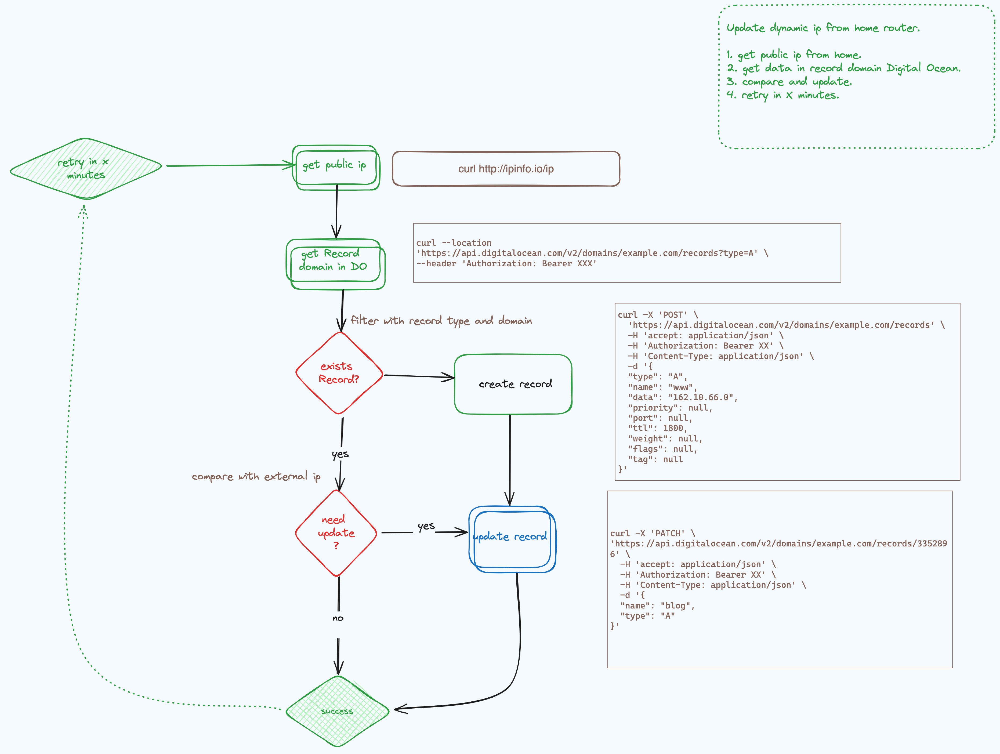

# DIGITAL OCEAN DYNAMIC DNS UPDATE

This script is used to update the DNS record of a domain hosted on Digital Ocean. 
It is useful when you have a dynamic IP address and you want to keep your domain pointing to your server.

## How works
 

## How to use

You can run the script with the following command:

```bash
./do_ddns.py -t <DO_API_TOKEN> -d <DOMAIN> -r <RECORDS>
```
This update a list of records in to the domain.

Or you can run use docker:

```bash
docker build -t do_ddns .
docker run -e DO_API_TOKEN -e DOMAIN -e RECORDS do_ddns
```

Advantages to use docker:
- You don't need to install python
- You don't need to install the dependencies
- You can run the script in any OS
- And the most important: You can update every 5 minutes using a cron job 

